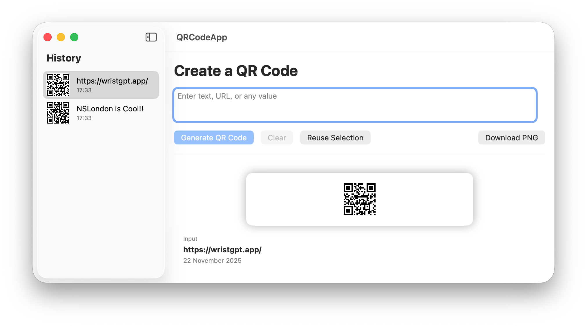

# QRCodeApp

A powerful and native macOS application built with SwiftUI for generating, managing, and exporting QR codes.



## Overview

QRCodeApp is designed to be a simple yet effective tool for anyone needing to generate QR codes on their Mac. Whether you need a code for a website URL, a Wi-Fi password, or plain text, QRCodeApp handles it instantly. It keeps a history of your generated codes so you can easily retrieve them later.

## Features

- **⚡️ Instant Generation**: Create QR codes in real-time as you type or upon clicking generate.
- **📜 History Sidebar**: Automatically saves your generated codes. Click on any item in the sidebar to view or reuse it.
- **💾 Export to PNG**: Save your QR codes directly to your disk as high-quality PNG images.
- **🎨 Native SwiftUI Interface**: Enjoy a clean, modern, and responsive user interface that feels right at home on macOS.
- **Dark Mode Support**: Fully compatible with macOS system appearance settings.

## Project Structure

The project follows a clean MVVM architecture:

```
QRCodeApp/
├── QRCodeApp/
│   ├── App/
│   │   ├── QRCodeAppApp.swift    # App Entry Point
│   │   └── ContentView.swift     # Main Navigation Structure
│   ├── Views/
│   │   ├── QRCodeGeneratorView.swift # Main input and generation view
│   │   ├── HistorySidebarView.swift  # Sidebar list of previous codes
│   │   └── QRCodeDetailView.swift    # Detail view for selected QR code
│   ├── ViewModels/
│   │   └── QRCodeViewModel.swift     # Central business logic
│   ├── Services/
│   │   ├── QRCodeGenerator.swift     # Core QR code generation logic
│   │   ├── ImageExporter.swift       # Handling file exports
│   │   └── QRCodeHistoryStore.swift  # Persistence for history
│   └── Models/
│       └── QRCodeEntry.swift         # Data model for QR codes
├── QRCodeAppTests/                   # Unit Tests
└── QRCodeAppUITests/                 # UI Tests
```

## Requirements

- macOS 14.0+
- Xcode 15.0+ (for development)

## Getting Started

1. Clone the repository.
2. Open `QRCodeApp.xcodeproj` in Xcode.
3. Build and run the `QRCodeApp` scheme on your Mac.

## License

This project is licensed under the MIT License.
